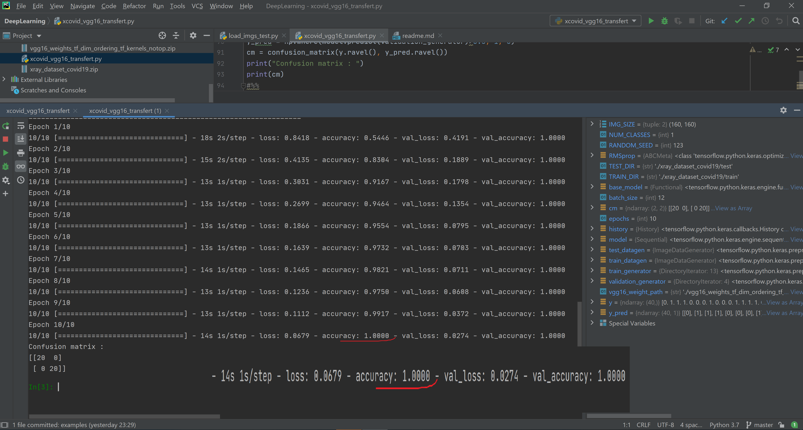
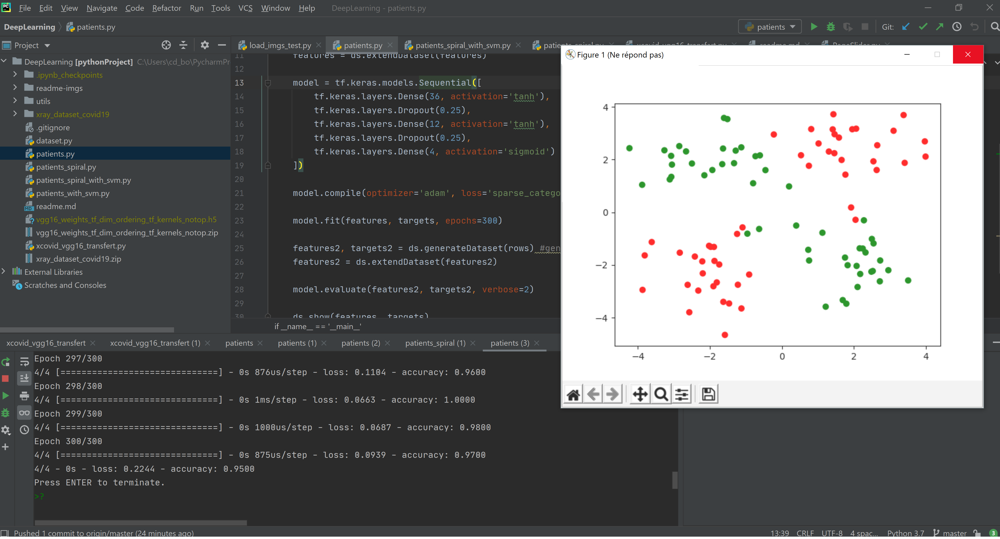
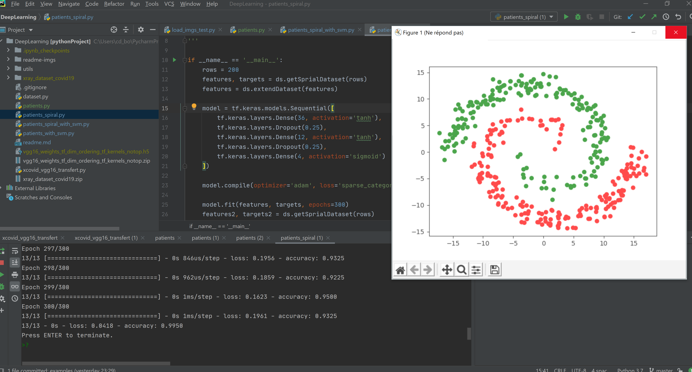

  
<h1 align="center">    
       
    Machine / Deep Learning examples    
       
</h1>    
    
<h4 align="center">Basic machine learning and neural networks examples using Tensorflow, SKLearn and VGG16for Transfer Learning in CNNs</h4>    
    

    
        
        
        
        
        

        

## Xray XCovid Example ##
Using the transfer of the pre-trained model VGG16, we reach a very high accuracy very quickly
 
  

## Patients Example ##

Implemented with **neural networks** using **TensorFlow** and **SVM** using **SKLEARN**
## A Linear distribution ##
  

## A Spiral distribution ##
  

## Author ##
[Nassim MOUALEK](https://www.linkedin.com/in/nassim-moualek-8ab7231a/), Dec.2020        
