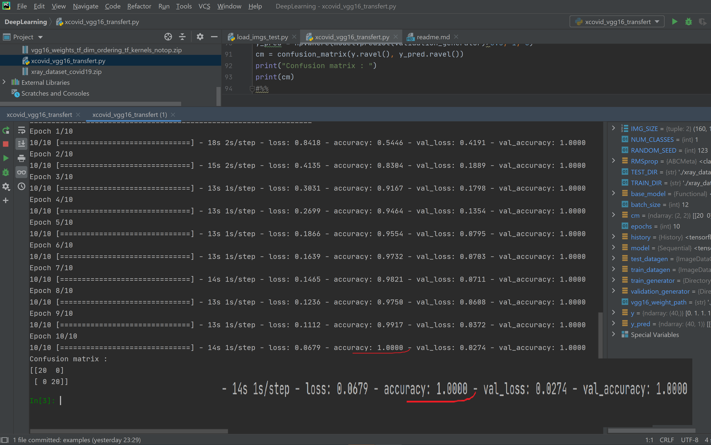
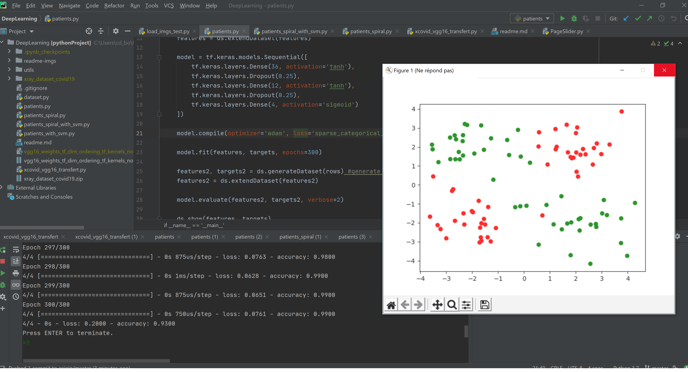
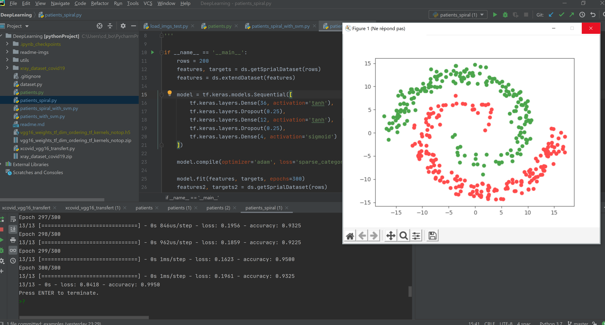

  
<h1 align="center">    
       
    Machine / Deep Learning examples    
       
</h1>    
    
<h4 align="center">Basic machine learning and neural networks examples using Tensorflow, SKLearn, BIRT for NLP and VGG16 for Transfer Learning in CNNs</h4>    
    

    
        
        
        
        
        

        

## Xray XCovid Example ##
Using the transfer of the pre-trained **VGG16** model, we reach a very high accuracy very quickly
     
    vgg16_weight_path = './vgg16_weights_tf_dim_ordering_tf_kernels_notop.h5'
    base_model = VGG16(
        weights=vgg16_weight_path,
        include_top=False,
        input_shape=IMG_SIZE + (3,)
    )
    
    model = Sequential()
    model.add(base_model)
    model.add(layers.Flatten())
    model.add(layers.Dense(96, activation='tanh'))
    model.add(layers.Dropout(0.3))
    model.add(layers.Dense(16, activation='tanh'))
    model.add(layers.Dropout(0.2))
    model.add(layers.Dense(1, activation='sigmoid'))
    model.layers[0].trainable = False
    
    model.compile(
        loss='binary_crossentropy',
        optimizer=RMSprop(lr=1e-3),
        metrics=['accuracy']
    )
  

## Patients Example ##

Implemented with **neural networks** using **TensorFlow** and **SVM** using **SKLEARN**

## A Linear distribution ##
    features, targets = ds.generateDataset(rows)
    features = ds.extendDataset(features)

    model = tf.keras.models.Sequential([
        tf.keras.layers.Dense(36, activation='tanh'),
        tf.keras.layers.Dropout(0.25),
        tf.keras.layers.Dense(12, activation='tanh'),
        tf.keras.layers.Dropout(0.25),
        tf.keras.layers.Dense(4, activation='sigmoid')
    ])

    model.compile(optimizer='adam', loss='sparse_categorical_crossentropy', metrics=['accuracy'])

    model.fit(features, targets, epochs=300)
  

## A Spiral distribution ##
    # We keep the same neural network and change the Dataset generator
    features, targets = ds.getSprialDataset(rows)
    features = ds.extendDataset(features) 
    # we extend the Features (X, Y) with (X°2, Y°2, X1*X2, sin(X1), sin(X2)
  

## Author ##
[Nassim MOUALEK](https://www.linkedin.com/in/nassim-moualek-8ab7231a/), Dec.2020        
